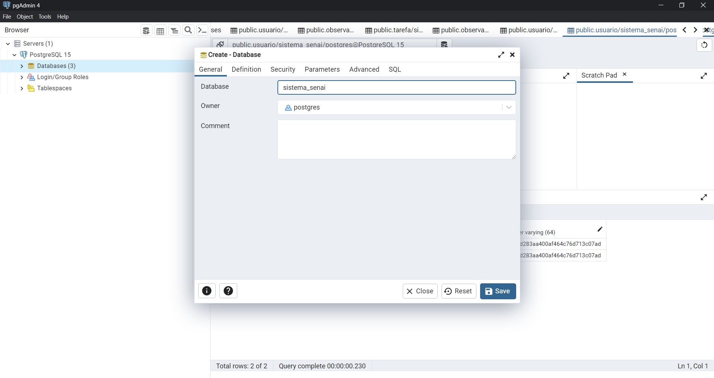
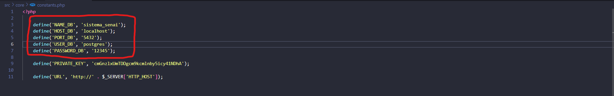
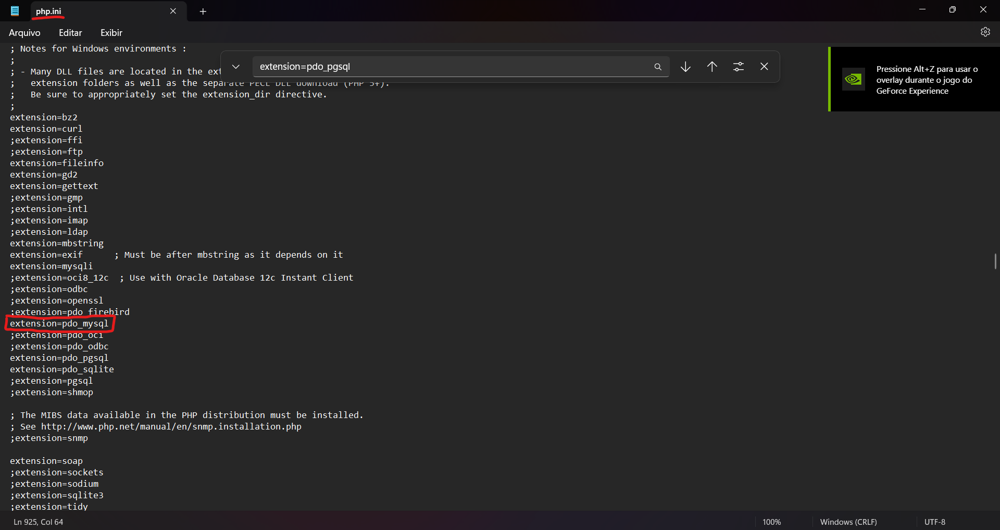
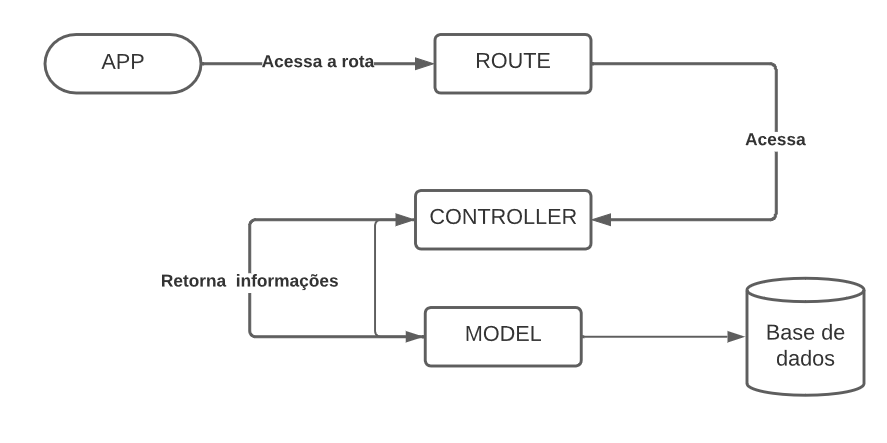

# Sistema

Para iniciar o sistem você deve ter:
- PHP V. >7.2
- PostgeSQL
- Composer 

# Iniciar o servidor de banco da dados do PostgeSQL

Criar um banco de dados vazio com o nome de "sistema_senai".

 

E acessar o arquivo `src\core\constants.php`, adicionando as suas credenciais necessárias.

 

## Baixar as dependências e iniciar o autoload
```
$ composer i
$ composer dump-autoload
```

## Rodar as migrations:
```
$ vendor/bin/phinx migrate
```

## Rodar o Servidor PHP
```
$ php -S localhost:3000
```

## Em caso de erro com o drive do PostgeSQL no PHP

Você precisa habilitá-lo no seu arquivo `php.ini` o driver do PDO PostgreSQL. Você pode fazer isso descomentando a linha `extension=pdo_pgsql.so` (ou `extension=pdo_pgsql.dll` para sistemas Windows) no seu arquivo `php.ini`. Certifique-se de reiniciar o servidor web após fazer essas alterações.

 

## Os usuários criados por padrão são

### Usuário 01
- Email: rodrigo@gmail.com
- Senha: 12345678


### Usuário 02
- Email: pedro@gmail.com
- Senha: 12345678

# Sobre o Sistema

O sistema é dividido em quatro camadas.
- Controller
- Routes
- Models
- Entities

A camada Router é responsável por gerenciar as informações que são recuperadas do Cliente e passar para a camada Controller. Na camada Controller, é utilizado as informações passadas pela Router e se comunica com o Model que fica responsável por fazer operações com o banco de dados utilizando a classe DBConnection.

A classe Entity é usada para representação das minhas entidades do banco.

Na classe Functions, estão os métodos que são utilizados por todo o sistema.
Na classe DBConnection, estão os métodos responsáveis por criar as query personalizadas e executar consultas com o banco de dados.

## O ciclo de funcionamento da aplicação funciona da seguinte forma:

 

# Processo seletivo - QA

Bem vindo, candidato. 

Estamos felizes que você esteja participando do processo seletivo para a vaga de QA do Senai - Soluções Digitais.

A prova deverá utilizar as seguintes tecnologias: 
- Linguagem de programação orientada a objeto para web
- Banco de dados relacional
- GIT

Fica à sua escolha quais frameworks e servidor serão utilizados, desde que seja uma aplicação web. 

Na etapa da entrevista deverá ser apresentado a aplicação em funcionamento.

## Instruções para a execução da prova

A prova deve ser uma aplicação web. Você pode escolher a tecnologia que achar conveniente (PHP, JAVA, etc...).

O Banco utilizado na prova deve ser PostgrSQL.

Esse repositório possui apenas esse Readme com as instruções da prova. No entanto, **todo desenvolvimento deve ser commitado nesse repositório** até a data citada no email, enviado por nossa equipe.

Commite nesse repositório o script utilizado na criação do banco de dados (se aplicável).

Por fim, altere esse arquivo com as instruções de como poderemos testar o seu código (quais libs usar, qual servidor, etc) abaixo.

## Será avaliado
- Qualidade do código quanto a:
  - Facilidade no entedimento
  - Complexidade ciclomática
  - Divisão de resposabilidade das classes
  - Reutilização de código
- Qualidade quanto a interface:
  - Fácil usabilidade
  - Acessibilidade
  - Feedback ao usuário
- Qualidade quanto aos requisitos:
  - Desenvolvimento e funcionamento dos requisitos propostos.

## Informações extras

- Descreva ao final deste documento (Readme.md) o detalhamento de funcionalidades implementadas, sejam elas já descritas na modelagem e / ou extras.
- Detalhar também as funcionalidades que não conseguiu implementar e o motivo.
- Caso tenha adicionado novas libs ou frameworks, descreva quais foram e porque dessa agregação.

(Escreva aqui as instruções para que possamos corrigir sua prova, bem como qualquer outra observação sobre a prova que achar pertinente compartilhar)
